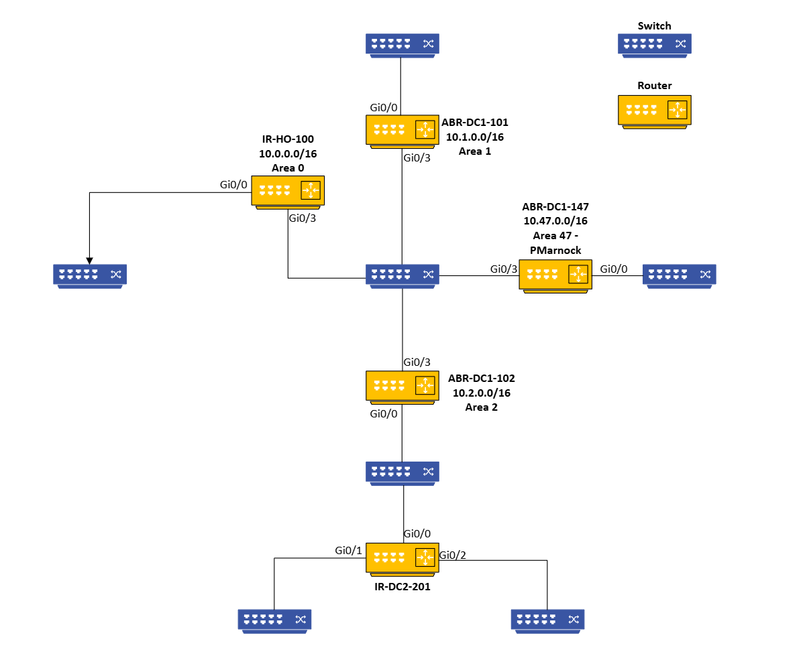

# Assigment 5 Diagram and Testing

## 1. Diagram


## 2. Testing
### IR-HO-100
```bash
# Ping Tests
ping 10.255.255.101
ping 10.255.255.102
ping 10.255.255.147
# Show Routing
sh ip route
# Confirm OSPF Interface 
sh ip ospf int brief
# Confirm OSPF Neighbor config 
show ip ospf neighbor
```
| Test Command               | Result           |
|----------------------------|----------------|
| ping 10.255.255.101        | Success        |
| ping 10.255.255.102        | Success        |
| ping 10.255.255.147        | Success        |
| show ip route              | Success        |
| show ip ospf interface brief | Success |
| show ip ospf neighbor       | Success |
### ABR-DC1-101
```bash
# Ping Tests
ping 10.255.255.100
ping 10.255.255.102
ping 10.255.255.147
# Show Routing
sh ip route
# Confirm OSPF Interface 
sh ip ospf int brief
# Confirm OSPF Neighbor config 
show ip ospf neighbor
```
| Test Command               | Result           |
|----------------------------|----------------|
| ping 10.255.255.100        | Success        |
| ping 10.255.255.102        | Success        |
| ping 10.255.255.147        | Success        |
| show ip route              | Success        |
| show ip ospf interface brief | Success |
| show ip ospf neighbor       | Success |
### ABR-DC2-102
```bash
# Ping Tests
ping 10.255.255.100
ping 10.255.255.101
ping 10.255.255.147
# Show Routing
sh ip route
# Confirm OSPF Interface 
sh ip ospf int brief
# Confirm OSPF Neighbor config 
show ip ospf neighbor
```
| Test Command               | Result           |
|----------------------------|----------------|
| ping 10.255.255.100        | Success        |
| ping 10.255.255.101        | Success        |
| ping 10.255.255.147        | Success        |
| show ip route              | Success        |
| show ip ospf interface brief | Success |
| show ip ospf neighbor       | Success |
### ABR-DC47-147
```bash
# Ping Tests
ping 10.255.255.100
ping 10.255.255.101
ping 10.255.255.102
# Show Routing
sh ip route
# Confirm OSPF Interface 
sh ip ospf int brief
# Confirm OSPF Neighbor config 
show ip ospf neighbor
```
| Test Command               | Result           |
|----------------------------|----------------|
| ping 10.255.255.100        | Success        |
| ping 10.255.255.101        | Success        |
| ping 10.255.255.102        | Success        |
| show ip route              | Success        |
| show ip ospf interface brief | Success |
| show ip ospf neighbor       | Success |
### IR-DC2-201
```bash
# Ping Tests
ping 10.255.255.100
ping 10.255.255.101
ping 10.255.255.102
ping 10.255.255.147
# Show Routing
sh ip route
# Confirm OSPF Interface 
sh ip ospf int brief
# Confirm OSPF Neighbor config 
show ip ospf neighbor
```
| Test Command               | Result           |
|----------------------------|----------------|
| ping 10.255.255.100        | Success        |
| ping 10.255.255.101        | Success        |
| ping 10.255.255.102        | Success        |
| ping 10.255.255.147        | Success        |
| show ip route              | Success        |
| show ip ospf interface brief | Success |
| show ip ospf neighbor       | Success |
